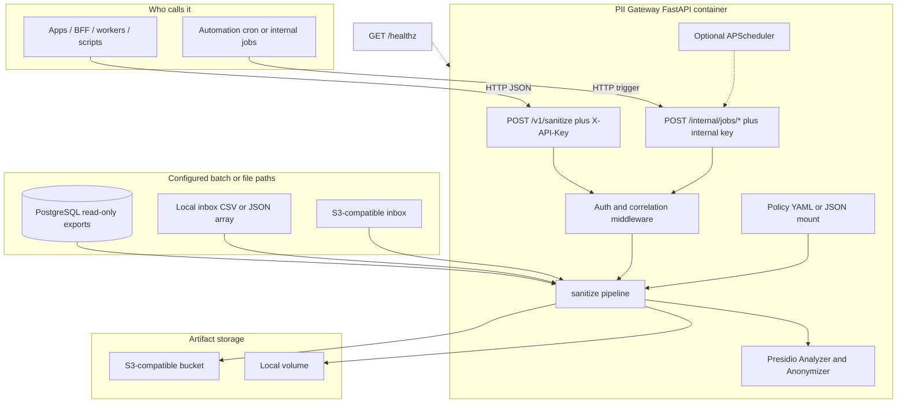

# PII Gateway

> **One-line summary:** A Docker-friendly **Presidio + FastAPI** service that scrubs **plain text** and **nested JSON** using a mounted **policy file**, with optional **batch/file ingestion** and **artifact storage**. It centralizes redaction but, is **not** a substitute for a full compliance program or a database firewall (personal / learning project).

---

## Architecture diagram

**View this chart**

- **On GitHub:** this section renders below when you open `PROJECT.md` on github.com.
- **In any browser:** from repo root run `cd docs && python3 -m http.server 8765`, then open [http://127.0.0.1:8765/view-architecture.html](http://127.0.0.1:8765/view-architecture.html) (loads `docs/architecture.mmd` automatically).
- **Editor / export:** open [mermaid.live](https://mermaid.live) and paste the contents of [`docs/architecture.mmd`](docs/architecture.mmd) (PNG/SVG export supported there).

**Keep in sync:** the Mermaid below should match [`docs/architecture.mmd`](docs/architecture.mmd) (canonical source).

**Optional demo GIF:** add a hosted link here if you record a walkthrough (`curl` + Compose up).

---

## What problem this solves

**PII Gateway** is a **small standalone service** (usually run in Docker) that:

1. Takes data in (**text**, **nested JSON**, or batch/file/DB then, export paths depending on setup).
2. Finds sensitive-looking pieces (emails, phone-style patterns, NLP-detected entities, etc. which is driven by **Presidio** + **your policy**).
3. Returns a **cleaned** version—and **optionally** writes **before/after artifacts** to **local disk** or **S3-compatible** storage.

Use it when you want a **single point** between “messy sources” and “downstream tools that shouldn’t see raw PII” (analytics, uncertain logging, experimentation with LLMs, etc.). The README states clearly that **batch SQL must be reviewed, parameterized, and read-only** as this is currently **not** a safe OLTP proxy.

---

## How it works

1. **Startup** — Load **environment** settings and **policy** (YAML/JSON). Build **Presidio** analyzer + anonymizer **once**, keep them on **`app.state`**. Pick **storage** (local vs S3-style). Optionally open a **Postgres** engine for batch reads and attach **APScheduler** (or disable with `DISABLE_SCHEDULER=true` for local dev).

2. **Realtime path** — Clients call **`POST /v1/sanitize`** with **`X-API-Key`**. The same **pipeline** can sanitize optional **free text** plus a **`structured`** object: detect entities, apply policy (including **per-field structured rules**), return the result. If policy persistence is on, the service writes **raw** / **cleaned** blobs through the **storage interface**—ordinary logs stay structured and avoid raw payloads where the code path is careful by design (**see tests**).

3. **Batch / files** — **`POST /internal/jobs/postgres-batch`** and **`POST /internal/jobs/file-ingest`** (separate **`INTERNAL_JOB_API_KEY`**) trigger bulk flows: ingest, run sanitization, write outputs. File sources can be **local paths** or **S3-compatible** “inbox” depending on configuration.

<!-- **One metaphor:** **one brain** (policy + Presidio + pipeline), **several doors in** (HTTP sanitize, DB export batch, files). -->

---

## Architecture at a glance

| Part |  role |
|--------|------------|
| **FastAPI app** (`main.py`) | HTTP server; startup/shutdown, routes |
| **Lifespan / `app.state`** | Shared Presidio, policy, storage, optional async Postgres engine, optional scheduler |
| **`POST /v1/sanitize`** | API-key gated realtime sanitize + optional artifact writes |
| **`/internal/jobs/*`** | Internal-key gated one-shot batch Postgres / file ingest |
| **Core pipeline** | Text + structured JSON sanitization (`core/sanitize_pipeline.py` and helpers) |
| **Storage** | `OutboundStorage` protocol: **local volume** or **S3-compatible** (`storage/`) |
| **Scheduler** | Optional recurring work via **APScheduler** |

---

## Stack

* **Runtime:** Python 3.11+, **FastAPI** + **Uvicorn**; **Presidio** analyzer/anonymizer via **lifespan** singletons.
* **Policy:** `PII_GATEWAY_CONFIG_PATH` → **YAML/JSON** (entities, structured field rules, batch queries, file inbox, persistence flags).
* **Secrets:** **Env vars only** (API keys, DSN, S3 credentials)—see `.env.example`.
* **Batch / IO:** **SQLAlchemy async** + **asyncpg** (Postgres path); **pandas** where CSV batch needs it; **aioboto3** for S3-compatible I/O.
* **Packaging:** **Dockerfile**, **docker-compose.yml**, optional **`docker-compose.example.yml`** (e.g. Postgres + MinIO + gateway).
* **Quality in repo:** **pytest**, **ruff**, **mypy** (strict) under dev extras.

**Skills this repo exercises**

* **FastAPI:** routes, lifespan, shared `app.state`, middleware (correlation id, optional CORS).
* **Pydantic v2:** HTTP request/response models and typed settings (`pydantic-settings`).
* **Presidio:** wiring **AnalyzerEngine** / **AnonymizerEngine** once per process for text + JSON string walks.
* **Async I/O:** **SQLAlchemy 2 async** + **asyncpg**, **async** artifact writes (`aioboto3` for S3-compatible backends).
* **Docker / Compose:** single-container default; optional compose overlay for Postgres + object storage patterns.
* **Testing:** layered **pytest** suite (heavy **unit**, lighter **integration** HTTP tests with temp dirs).

---

## What can connect today

* **Any client** that can send **JSON** over HTTP with **`X-API-Key`** → **`POST /v1/sanitize`** (app, BFF, worker, script, `curl`).
* **Automation / sidecar cron** with **`INTERNAL_JOB_API_KEY`** → **`POST /internal/jobs/postgres-batch`** or **`/internal/jobs/file-ingest`** for bulk pipelines (not for public internet exposure).
* **Downstream readers** of **artifact paths** (local directory or S3 bucket) if policy persistence is enabled.
* **Infra:** Compose-based deploy; **`GET /healthz`** for liveness.

There is **no shipped “plugin SDK”**; new integrations are usually **new callers** of these HTTP surfaces—or **new connector code** under `src/pii_gateway/connectors/` / `jobs/` following existing patterns. Havent currently real-world tested all options, so might throw unrealised errors.

---

## Tests

* **Unit** (`tests/unit/`) — config loader, auth, sanitize text/structured, batch CSV/JSON helpers, Postgres stream helpers, paths, storage factory, entity summary, expectations around **not logging raw payloads** in core paths, etc.
* **Integration** (`tests/integration/`) — **Starlette `TestClient`** against the real app: sanitize API, internal jobs, correlation-id middleware.
* **Harness** — `tests/conftest.py` sets temp **storage/state** dirs, test keys, scheduler off, so runs are reproducible.

<!-- **Portfolio note:** the intended workflow is **`pytest`** (and `ruff` / `mypy`) before merge; CI is whatever you attach on GitHub Actions—this repo documents local commands in [README.md](README.md) under “Local development”. -->

---

## Keeping this file accurate as the repo changes

Treating **PROJECT.md** as tracking three **sections** that update the matching section when code changes:

1. **Inbound** — How data enters (today: sanitize API + internal jobs + optional scheduler). If you add queues, webhooks, etc., add a bullet under **What can connect today** *and* update [`docs/architecture.mmd`](docs/architecture.mmd) + the Mermaid block above.
2. **Policy / behavior** — “What gets redacted and how” lives in the **policy file**; don’t duplicate every key here—point to [README.md](README.md) for integrator detail.
3. **Outbound** — Where artifacts land (**local** vs **S3-compatible**) and which **env vars** gate it.

**README** = manual. **PROJECT.md** = narrative + scope.

---

## Why Even?

I wanted **one obvious service** between messy payloads and downstream tools (**analytics**, **logging**, **LLM experiments**) so scrubbing logic would not be needed yo reproduce across every repo. This project was a practical way to learn **Docker-first** packaging, **env-based secrets** versus **mounted policy**, and holding **heavy NLP libs** efficiently in a long-lived FastAPI process—without pretending the result replaces enterprise DLP or compliance review.

---

## Current state (what works today)

**Documented behavior of this repo:**

* **Compose-first** run: `docker compose up --build`; **`GET /healthz`**.
* **`POST /v1/sanitize`** requires **`X-API-Key`**; missing **`SANITIZE_HTTP_API_KEY`** → **503** on sanitize routes.
* **Presidio-backed** cleanup on optional **text** + **`structured`** JSON per policy (`structured_field_rules`, entity allowlists, etc.).
* **Internal** batch/file triggers under **`/internal/jobs/*`**; SQL paths are **not** a generic safe DB proxy.
* **License:** MIT — [LICENSE](LICENSE).

**What paths people usually exercise first**

* **Baseline:** Compose + **`/v1/sanitize`** using the README `curl` example + **`pytest`** locally.
* **Optional:** Postgres batch and MinIO-style stacks need extra env wiring—see **`docker-compose.example.yml`** and the README batch sections.

**Known limits (honest)**

* **No** packaged threat model or external pen test—the risk profile is yours to define.
* The sanitization pipeline is oriented around **English** (`language="en"` in Presidio calls)—other languages need deliberate changes and models.
* **False positives / negatives** are normal for NLP + regex; **policy tuning** and **human review** still matter.

---

## What was new?

* **Singleton Presidio engines** loaded in FastAPI **lifespan** beat spinning analyzers per request—startup cost once, predictable memory profile.
* **Policy as a mounted file** and **secrets in env** keeps git diffs reviewable without baking credentials into Compose YAML (beyond dev samples).
* A thin **storage interface** (`OutboundStorage`) keeps “write cleaned blobs” testable with **temp dirs** and swappable backends.
* **Structured logs** (`log_event`) and tests like `test_core_no_logging` reinforced how easy it is to leak PII if you log payloads by habit.
* **Integration tests with `TestClient`** catch auth and HTTP shape regressions cheaply compared to hitting Docker every time.

---

## Future roadmap

Directional ideas—not commitments.

* **Published container image** (e.g. `ghcr.io`) with semver tags plus a minimal CI smoke test.
* **OpenTelemetry** hooks around sanitize latency and storage writes for debugging production-like paths.
* **More integration coverage** against real MinIO + Postgres fixtures in CI (today much of Postgres/S3 logic is primarily unit-tested or manual).
* **Policy versioning metadata** surfaced in responses or artifact metadata for audit trails.
* **Non-English** routes or config-driven language if you need them.

---

## Links

* **Repo:** `https://github.com/<your-username>/pii-gateway` — replace with your public clone URL when you publish.
* **Operator / integrator docs:** [README.md](README.md)
* **Contributing:** [CONTRIBUTING.md](CONTRIBUTING.md)
* **Diagram source:** [docs/architecture.mmd](docs/architecture.mmd) · **Browser viewer:** [docs/view-architecture.html](docs/view-architecture.html)

---

<!-- ## Resume / elevator lines

Pick one tone (all factually grounded in what the repo ships):

* **One line:** Dockerized **FastAPI + Presidio** gateway; **YAML/JSON policy** drives redaction over **`POST /v1/sanitize`**; optional Postgres/S3 batch paths (**personal project**).

* **Slightly fuller:** Built a **12-factor-style** sanitization gateway: **singleton Presidio** behind FastAPI **lifespan**, **API-key** realtime JSON API, optional **artifact storage** (**local/S3-compatible**), and **pytest** layering—learning project, not a compliance product claim. -->
