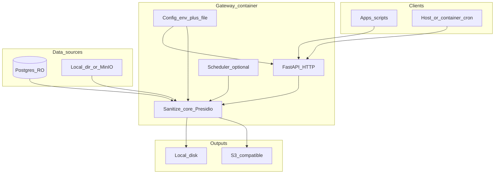

# PII Gateway — architecture plan (self-hosted OSS)

**Status:** Active blueprint for an **open-source, self-hostable** PII sanitization gateway (distribution UX similar in spirit to n8n: Docker / Compose quick start, optional cloud). **Not** a hosted multi-tenant B2C SaaS.

**Related rules:** [`.cursorrules`](.cursorrules) — **Docker-first**, **containerized FastAPI**, **12-Factor** config/logging, **local / S3-compatible storage**, functional style, strict typing, Pydantic v2, async I/O, Presidio **`AnalyzerEngine` once per process** (lifespan), never log raw PII.

---

## Vision & non-goals

| In scope (v1) | Out of scope (v1) |
|-----------------|-------------------|
| Developers run **one container** (or Compose stack) locally or on PaaS | Hosted multi-tenant SaaS, enterprise sales features |
| **Realtime HTTP JSON API** for text + structured payloads (unchanged product idea) | Consumer-facing hosted UI (optional third-party UIs call the API) |
| **PostgreSQL** batch (read-only, parameterized SQL) on a **schedule** | Calling LLMs on behalf of users |
| **File ingest**: local watch directory **or** **S3-compatible** API (MinIO, R2, etc.) — **CSV (Pandas)** + **JSON array** files for batch | Opaque binary extraction (PDF/images) without a separate tool |
| Outputs via **Outbound Storage Interface** (local Docker volume **or** S3-compatible, from `.env`) | Mandatory use of a specific cloud to run the core app |
| Batch sources: **PostgreSQL (SQLAlchemy)**, **CSV**, **JSON arrays** only | **DynamoDB** (and other NoSQL DBs) as MVP batch inbound adapters |

**License & community:** Ship under a **standard OSS license** (e.g. **MIT** or **Apache-2.0** — pick one at first release) and add **`CONTRIBUTING.md`** (PRs, code style, security reporting).

**Docs deliverables:** `README` with **~5-minute quickstart**, example **`docker-compose.yml`**, example stack (**Postgres + MinIO + gateway**), **threat model** summary, **production checklist**, and how to put the API behind **reverse proxy + OAuth** at the edge.

---

## Self-hosted OSS architecture

### Components

| Component | Role |
|-----------|------|
| **`gateway` (FastAPI)** | HTTP API, auth middleware, request/response schemas (Pydantic v2), wires adapters to **sanitization core**. |
| **Sanitization core** | Presidio-based NLP redaction + **structured field rules** from config; **single `AnalyzerEngine`** via app lifespan. |
| **Config loader** | Merges **`.env`-loaded environment** (see **Credential management**) + **mounted YAML/JSON** for non-secret policy (`PII_GATEWAY_CONFIG_PATH`). **Single-tenant by default** (`org_id` optional string for path labels only). |
| **Outbound Storage Interface** | Pluggable **write path** for sanitized artifacts: **`LocalVolumeBackend`** (Docker bind/volume) or **`S3CompatibleBackend`** (MinIO/R2/S3), chosen **only** from `.env` (`STORAGE_BACKEND`). Same logical key layout for both. |
| **Scheduler (batch)** | **APScheduler** (or similar) **inside the container** *or* external cron hitting an **internal-only** `POST /internal/jobs/...` endpoint — document both; default Compose uses in-process cron for simplicity. |
| **Batch inbound adapters (MVP)** | Exactly **three** implementations (see below): **PostgreSQL** (via **SQLAlchemy**), **CSV** (via **Pandas**), **JSON arrays** (files whose root is a JSON array of objects). **DynamoDB excluded from MVP.** Realtime **HTTP JSON** remains separate from the batch processor. |



### Credential management (OSS UX)

- **Single standard for operators:** All **permissions, connection URIs, and object-storage credentials** the engine needs are read from a **`.env` file** that is **mounted or injected into the container** (e.g. Docker Compose `env_file: .env`, or `--env-file .env` on `docker run`).  
- **No DynamoDB, no AWS Secrets Manager** in the default path—only **process environment** populated from that file (and optional platform secret injection on PaaS, which still surfaces as env vars).  
- Ship **`.env.example`** listing every variable with **empty or placeholder values**; document **never commit `.env`**.  
- **Policy tuning** (which entities to redact, named SQL, ingest paths) stays in the **mounted YAML/JSON** config file—**not** secrets—so it can live in Git; **passwords and keys never go in that file**.

### Outbound Storage Interface

Explicit contract for **writing sanitized outputs** (and optional `raw` copies):

| Implementation | When active (`.env`) | Behavior |
|------------------|---------------------|----------|
| **`LocalVolumeBackend`** | `STORAGE_BACKEND=local` | Writes under `STORAGE_LOCAL_PATH` (typically a **Docker named volume** or bind mount). Survives container restarts when a volume is used. |
| **`S3CompatibleBackend`** | `STORAGE_BACKEND=s3` | Uses **S3-compatible API** (`S3_ENDPOINT_URL` for MinIO/R2; omit for AWS S3). Credentials and bucket from **`.env`** (`AWS_ACCESS_KEY_ID`, `AWS_SECRET_ACCESS_KEY`, `S3_BUCKET`, `S3_PREFIX`, region as needed). |

**Interface shape (conceptual):** `write_artifact(layer, relative_key, bytes, content_type) -> None` where `layer` is `raw` | `cleaned` (and later `analytics` if enabled). Callers (HTTP handler, batch job) depend on this **interface**, not on filesystem vs HTTP API details.

### Batch inbound adapters (MVP — three only)

The **batch processor** normalizes all sources into **row-like records** before the sanitization core. **DynamoDB is not supported in v1.**

| Adapter | Library / mechanism | Input | Notes |
|---------|---------------------|-------|--------|
| **PostgreSQL** | **SQLAlchemy** (async engine where applicable) | Read-only DSN from **`.env`**; **named, parameterized** queries from policy YAML only | Stream or chunk rows; no string-concatenated SQL from user input. |
| **CSV** | **Pandas** (`read_csv` or chunked reader) | Files from **local inbox path** or **S3-compatible prefix** (paths from config + creds from **`.env`**) | Enforce size limits; consistent dtype handling; fail closed on malformed files. |
| **JSON arrays** | **`json` + iteration** (Pandas optional for normalization) | Files whose **root JSON value is an array** of homogeneous objects | **NDJSON / JSON Lines** may be a follow-up; MVP doc focuses on **single JSON file = one array**. |

**Realtime HTTP** adapter is unchanged: JSON request body over FastAPI, same core, optional write via **Outbound Storage Interface**.

### Data flow (high level)

1. **Realtime:** Client `POST /v1/sanitize` (or similar) with JSON body → validate → resolve policy from **file+env** → run Presidio + structured rules → return **JSON envelope** (same spirit as prior “Playground” contract: `ok`, `correlation_id`, `result` with **no raw PII**). Optionally **persist** `cleaned` (and `raw` if enabled) via storage backend.
2. **Postgres batch:** Scheduler fires → **SQLAlchemy** connector uses **`POSTGRES_BATCH_DSN` from `.env`** → runs **only parameterized** named queries from policy YAML → rows through core → **`Outbound Storage Interface`**.  
3. **CSV batch:** Scan **inbox** (local volume or S3-compatible) → **Pandas** parse → core → outbound interface.  
4. **JSON array batch:** Same scan path → parse **array-of-objects** JSON → core → outbound interface.

---

## Storage layout: smallest useful default (v1)

**Default recommendation: `cleaned`-only persistence for v1** for API-driven flows, with **optional** `raw` opt-in.

| Layer | v1 default | Rationale |
|-------|------------|-----------|
| **raw** | **Off** for HTTP API; **optional** for batch/file when compliance needs a verifiable audit trail | Reduces duplicate sensitive-at-rest data; many self-hosters only need “safe copy out.” |
| **cleaned** | **On** — primary artifact path | This is the product’s main value. |
| **analytics** | **Off** until a second milestone | Requires schema contracts and jobs; avoid scope creep. |

**Path shape (single-tenant):**  
`<STORAGE_ROOT>/cleaned/<source>/<YYYY>/<MM>/<DD>/<correlation_id>.<ext>`  
If `raw` enabled: parallel tree under `raw/...`.  
If **multi-tenant flag** enabled later: insert `tenant_id=<id>/` after root (optional).

S3-compatible keys mirror the same logical segments (no need for Hive partitions until analytics land).

---

## Configuration schema (`.env` + policy file)

**Single-tenant default:** one deployment = one org. **Optional:** `MULTI_TENANT=true` + config array of tenants (advanced; defer until needed).

### `.env` (credentials & runtime — mounted into container)

All **sensitive and connection-related** values live here and are loaded as **environment variables**:

| Variable | Purpose |
|----------|---------|
| `PII_GATEWAY_CONFIG_PATH` | Path inside container to **non-secret** policy YAML/JSON (mounted volume). |
| `SANITIZE_HTTP_API_KEY` | HTTP API auth (or `BASIC_AUTH_USER` / `BASIC_AUTH_PASSWORD` if documented). |
| `STORAGE_BACKEND` | `local` \| `s3` — selects **Outbound Storage Interface** implementation. |
| `STORAGE_LOCAL_PATH` | Root directory for **`LocalVolumeBackend`** (Docker volume mount target). |
| `S3_ENDPOINT_URL` | Optional; MinIO/R2/custom (omit for AWS S3). |
| `S3_BUCKET`, `S3_PREFIX` | Destination for **`S3CompatibleBackend`**. |
| `AWS_ACCESS_KEY_ID`, `AWS_SECRET_ACCESS_KEY`, `AWS_REGION` (or compat names) | S3-compatible **or** AWS credentials from `.env`. |
| `POSTGRES_BATCH_DSN` | SQLAlchemy URL for **read-only** Postgres batch adapter (e.g. `postgresql+asyncpg://...`). |
| `POSTGRES_BATCH_CRON` | In-process scheduler cron (or disable and use external cron). |
| Optional: keys for **reading** inbox files from S3-compatible source | Same pattern—**no** hard-coded keys in image. |

**Compose pattern:** `env_file: .env` on the `pii-gateway` service; optionally override with host environment for CI.

### Mounted file (YAML example sketch)

```yaml
config_version: 1
redaction_entities:
  - EMAIL_ADDRESS
  - PERSON
structured_field_rules:
  email: redact
  full_name: tokenize
postgres_batch:
  enabled: true
  query_name: export_users  # maps to predefined SQL id below
  queries:
    export_users:
      sql: "SELECT id, email, full_name, note FROM app.users WHERE updated_at > :since"
      params_from: last_run_cursor
batch_file_ingest:
  mode: local  # local | s3 (credentials always from .env)
  local_path: /data/inbox   # CSV + JSON-array files
  poll_seconds: 60
  # S3-compatible inbox: set mode: s3 + bucket/prefix via .env / policy as documented
persistence:
  write_raw: false
  write_cleaned: true
```

**Rule:** No ad-hoc SQL from HTTP — only **named queries** from config file (reviewed in Git).

---

## Security & threat model (summary for README)

- **This is not a database proxy** for application traffic. Batch jobs use **read-only** credentials and **bounded** queries; misuse as a live OLTP front would be unsafe and unsupported — state that explicitly in docs.
- **Never log raw bodies** or query result payloads; log **correlation_id**, **adapter name**, **config_version**, durations, counts only.
- **Secrets:** **Standard `.env`** mounted into the container (`env_file`); advanced operators may use Docker secrets **only if** they map into the same env var names at runtime—document the **canonical** approach as `.env` for simplicity. Never commit `.env`.
- **Auth:** Default **API key** header or **HTTP Basic** for the HTTP API; production deployments should use a **reverse proxy** (Traefik, Caddy, nginx) for **TLS**, **rate limiting**, and optional **OAuth2 proxy** at the edge.
- **Parameterized queries only** for Postgres; validate file types and size limits on upload paths.

---

## HTTP API (realtime) — JSON contract (unchanged intent)

Keep a **stable JSON envelope** for scripts and future UIs:

- **Success:** `ok`, `correlation_id`, `adapter`, `config_version`, `result` (redacted text / structured samples / entity summary counts — **no raw PII**), `meta`.
- **Error:** `ok: false`, `error.code`, `error.message` (no sensitive data).

**CORS:** Configurable allowed origins via env for browser-based tools.

---

## Connectors summary

| Surface | Trigger | Implementation notes |
|---------|---------|----------------------|
| **Realtime HTTP JSON** | FastAPI routes | Pydantic schemas; not part of the **batch** adapter set. |
| **Batch — PostgreSQL** | Cron / internal scheduler | **SQLAlchemy** + `.env` DSN; named parameterized queries in policy file. |
| **Batch — CSV** | Inbox scan | **Pandas**; paths and optional source S3 creds from **`.env`** + policy file. |
| **Batch — JSON arrays** | Inbox scan | Parse **JSON array of objects**; same outbound path as other batch adapters. |

**MVP exclusion:** **No DynamoDB** connector—add later if demand exists.

**Mock / fixture mode:** Optional env (e.g. `BATCH_DEMO_FIXTURE=true`) feeds synthetic rows **without** Postgres for CI/demos.

---

## Optional: AWS / Terraform (not required for core)

- **OpenTofu/Terraform modules** (later): S3 bucket + IAM for **artifact storage**; optionally **ECS Fargate** or **Lambda** packaging of the **same container image** for those who want AWS — **core Dockerfile must run standalone**.
- Do **not** require DynamoDB (not in MVP), API Gateway, EventBridge, or Secrets Manager for the default OSS path.

---

## Distribution: Docker & PaaS

- **`Dockerfile`:** multi-stage, slim base, non-root user, **healthcheck** on `/healthz`.
- **`docker-compose.yml`:** service `pii-gateway` with **`env_file: .env`**, optional `postgres`, optional `minio`, volumes for **policy config**, **outbound data** (`STORAGE_LOCAL_PATH`), and **CSV/JSON inbox** as needed.
- **PaaS:** Single container + attached disk or S3-compatible env vars; **Railway / Fly.io / Render** documented as “set these env vars, mount nothing or use platform secrets.”

---

## Minimal repo layout (Python / FastAPI)

```
pii-gateway/
  pyproject.toml / requirements.txt
  Dockerfile
  docker-compose.yml
  docker-compose.example.yml   # postgres + minio + gateway
  README.md
  CONTRIBUTING.md
  LICENSE
  config/
    examples/
      config.example.yaml
  src/
    pii_gateway/
      main.py                 # FastAPI app + lifespan (Presidio singleton)
      settings.py             # pydantic-settings from env
      config_loader.py        # merge env + YAML/JSON file
      api/
        routes_sanitize.py
        schemas.py            # Pydantic v2 request/response
      core/
        sanitize_text.py
        sanitize_structured.py
      storage/
        outbound_interface.py   # protocol / factory
        local_volume_backend.py
        s3_compatible_backend.py
      connectors/
        batch_postgres_sqlalchemy.py
        batch_csv_pandas.py
        batch_json_array.py
      jobs/
        scheduler.py
  tests/
    unit/
    integration/
```

Functional modules, **no classes** except where libraries require them.

---

## PR-sized milestones (suggested)

| Milestone | Scope | “Done” criteria |
|-----------|--------|-----------------|
| **Week 1** | **HTTP sanitize only** | Docker run; `POST /v1/sanitize`; Presidio singleton; config file + env; API key auth; unit tests for redaction paths; README quickstart. |
| **Week 2** | **Batch CSV + JSON + Outbound interface** | **Pandas** CSV + **JSON array** adapters; **Outbound Storage Interface** (local volume + MinIO); optional `write_raw`; `.env.example` complete. |
| **Week 3** | **Postgres batch** | **SQLAlchemy** read-only DSN from `.env`; named parameterized queries; cron in container; artifacts via **Outbound Storage Interface**; production checklist doc. |

After v1: Terraform examples, optional multi-tenant flag, `analytics` tier, more SQL engines.

---

## Historical comparison: prior Lambda-centric blueprint (archived intent)

The previous version of this document described a **multi-tenant AWS SaaS** shape: **API Gateway HTTP API**, **Lambda ARM64**, **EventBridge**, **DynamoDB** (`TenantConfig`, `TenantDataSource`), **Secrets Manager**, **S3 Medallion** paths per `tenant_id`.  

**This OSS plan replaces that as the product direction:** configuration is **file + env**, tenancy is **single-tenant default**, scheduling is **in-container or host cron**, storage is **local or S3-compatible**, and **AWS is optional** via future modules — not a runtime dependency.

---

## Changelog

- **2026-03-22:** Prior iterations — Lambda, DynamoDB, EventBridge, multi-tenant SaaS, HTTP API + ARM64, Playground JSON, mock DB adapter (superseded as **primary** architecture by this document).  
- **2026-03-22:** **Pivot to self-hosted OSS** — Docker-first, single-tenant config, S3-compatible + local storage, Postgres + file connectors, PR milestones, repo layout, threat model, docs/license deliverables.  
- **2026-03-22:** [`.cursorrules`](.cursorrules) aligned with pivot — **Docker-First**, **Containerized FastAPI**, **12-Factor**, **local/S3-compatible storage**; removed serverless/Lambda-first mandates.  
- **2026-03-22:** **Credential UX:** all DB/S3/API permissions via **mounted `.env`**; **Outbound Storage Interface** (local volume vs S3-compatible); batch adapters fixed to **Postgres/SQLAlchemy**, **CSV/Pandas**, **JSON arrays**; **DynamoDB out of MVP**.

---

## Open follow-ups (not blocking v1)

- Choose **MIT vs Apache-2.0** and add `LICENSE` + `CONTRIBUTING.md`.  
- Implement smallest vertical slice: **HTTP sanitize + local `cleaned` write** (when implementation mode is allowed).
