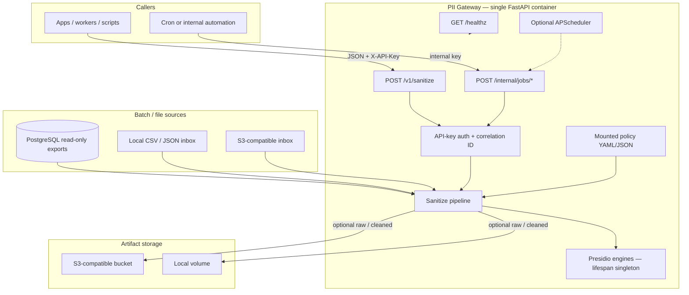

# Architecture — PII Gateway

## Premise

PII Gateway is a **single-container** FastAPI service that centralizes personal-data redaction before payloads reach analytics, logs, or third-party tools. Free text and nested JSON go through Microsoft Presidio (loaded once at process start) plus a mounted policy file for entity allowlists and per-field structured rules. The same sanitize core also powers optional PostgreSQL export batches and CSV/JSON inbox ingest. This is a personal / learning OSS project—not a compliance product or database firewall.

## Goals and non-goals

**Goals**

- One HTTP API (`POST /v1/sanitize`) for live text + nested JSON sanitization
- Reviewable **policy as a file**; **secrets only in env** (12-factor)
- Optional batch paths (Postgres named SQL, local or S3-compatible file inbox) sharing the same pipeline
- Optional `raw` / `cleaned` artifact writes to local disk or S3-compatible storage
- Structured stdout logs that never include raw bodies from the sanitization core

**Non-goals**

- Not a safe OLTP / generic SQL proxy (batch SQL is named, reviewed, parameterized; use read-only DB roles)
- Not multi-tenant SaaS, rate limiting, or reversible tokenization
- Not a packaged threat model or guarantee of zero false positives/negatives
- English-only Presidio language path today (`language="en"`)

## Unique approach

What was designed here (not stock framework defaults):

1. **Two-tier config boundary** — Non-secret policy (entities, field rules, named SQL, inbox paths) lives in mounted YAML/JSON and fails validation at startup on bad field actions. Credentials and DSNs stay in environment variables only.
2. **Fail-closed structured walk** — Recursive JSON sanitization applies explicit `redact` / `tokenize` / `mask` rules when declared; **undeclared string fields and `passthrough` still run through Presidio**. There is no silent “leave this string alone” escape hatch.
3. **Named SQL as a security boundary** — Batch queries come only from the policy file, selected by `query_name`, executed via SQLAlchemy `text()` with bound params. HTTP callers cannot supply SQL text.
4. **Privacy invariants in tests and telemetry** — Core sanitize modules are asserted to contain no `logging` imports (`test_core_no_logging`). Response/meta `entity_summary` is **counts by entity type only** (no spans/values). Artifact keys are UTC date partitions + UUID—no input-derived path segments.
5. **Presidio as a lifespan singleton** — `AnalyzerEngine` / `AnonymizerEngine` constructed once and injected into pure pipeline functions for predictable memory and testability.
6. **Documented pivot** — Early plans targeted Lambda/DynamoDB multi-tenant SaaS; the shipped design is Docker-first single-tenant OSS (see `architecture.plan.md` changelog).

## System overview

Canonical diagram: [`docs/architecture.mmd`](architecture.mmd) (also linked from `portfolio.yaml` for the portfolio site).



## Key components

| Piece | Role |
|-------|------|
| `main.py` + lifespan | Logging setup, settings, policy load, Presidio engines on `app.state`, storage factory, optional async Postgres engine, optional APScheduler |
| `POST /v1/sanitize` | Real-time sanitize; `X-API-Key` vs `SANITIZE_HTTP_API_KEY` (missing/blank key → 503) |
| `/internal/jobs/*` | One-shot Postgres batch or file ingest; `X-Internal-Job-Key` |
| `core/sanitize_*` | Free-text Presidio anonymize; recursive structured rules + NLP fallback |
| `connectors/` + `jobs/` | Postgres stream helper, CSV/JSON parsers, S3 inbox list/download, schedulers |
| `storage/` | `OutboundStorage` protocol: local volume or S3-compatible `put_object` |
| Policy + settings | `policy_schema.py` + `config_loader.py`; `settings.py` (pydantic-settings) |

## Data / control flow

1. **Startup** — Env + policy → mkdir state/storage → Presidio engines → storage backend → optional DB engine → optional scheduler.
2. **Realtime** — Validate body → auth → analyze/redact text and/or walk `structured` → optional artifact writes → `{ok, correlation_id, result, meta}` with counts-only `entity_summary`.
3. **Postgres batch** — Load cursor → run named SQL with optional `:since` → sanitize rows → NDJSON artifact → advance cursor (wall-clock `now()` today).
4. **File ingest** — Scan local inbox or S3 prefix → skip by fingerprint index → parse CSV/JSON array → sanitize → NDJSON → update index.
5. **Logging** — Structured JSON on stdout; allow-listed fields only (see `logging_config.py` docstring).

## Notable implementation details

- **`tokenize` is a label, not crypto** — Values become `<{FIELD}_TOKEN>` from the field name; not stable or reversible tokens.
- **Double Presidio analysis** — Counts for `entity_summary` and anonymization each call `analyze` (honest cost/inefficiency).
- **Batch memory** — Readers can stream/chunk, but jobs currently buffer rows before writing artifacts.
- **Local vs S3 dedupe** — Local fingerprints use `mtime_ns` + size; S3 path uses **size only** (content-same-size replacement can be skipped).
- **Auth ordering** — Body validation can return 422 before auth; misconfigured key returns 503 even if a key header is present.
- **Event-loop hygiene** — Heavy CSV/JSON/local writes use `asyncio.to_thread` where needed.

## Tradeoffs and limitations

- NLP + regex false positives/negatives; policy tuning and human review still matter
- S3 inbox, S3 outbound writes, live Postgres, and scheduler paths are implemented but less integration-tested than the HTTP sanitize path
- No request body size limit, rate limiting, or multi-key rotation on the HTTP API
- Dockerfile does not download a spaCy model (CI/README do)—verify image startup before assuming a clean `docker compose up`
- Coverage is reported in pytest but not gated (`--cov-fail-under=0`)

## How to verify locally

See [README.md](../README.md) for Compose quickstart, env/policy, and maintainer setup.

```bash
docker compose up --build
# or: pip install -e ".[dev]" && python -m spacy download en_core_web_sm && pytest
```

Visitor-facing copy: [`portfolio.yaml`](../portfolio.yaml). Narrative overview: [`PROJECT.md`](../PROJECT.md).
